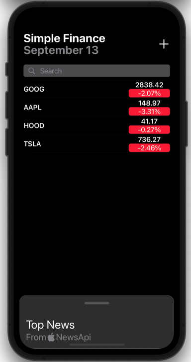

# SimpleFinance

Simple Finance Swift iOS app getting started.

Built using XCode 12.5.1 (Swift 5)

</img> 
</img> 

#### Requirements
* Cocoapods (https://cocoapods.org)
* XCode 12.5.1 +
* Swift 5.4.2 +

### How to run SimpleFinance?

1. Clone this repo
2. Open shell window and navigate to project folder
3. Run `pod install`
4. Open `SimpleFinance.xcworkspace` and run the project on selected device or simulator
5. Use "SimpleFinance" for username and "SimpleFinance" for password to log in to the app

### How was it created?

1. Open XCode. File->New->Project->Single View App->SimpleFinance
2. Create Podfile with your target name and Particle pods reference (see file)
3. Close XCode Project
4. Open shell window and navigate to the project folder
5. Run `pod install` (make sure your have latest [Cocoapods](https://guides.cocoapods.org/using/getting-started.html#installation)  installed), pods will be installed and new XCode workspace file will be created.
6. in XCode open the new `SimpleFinance.xcworkspace`
7. Build and run - works on simulator and device (no need to do any modifications to Keychain settings)
8. Click "Start setup" on the phone and onboard a new Photon to your account.
